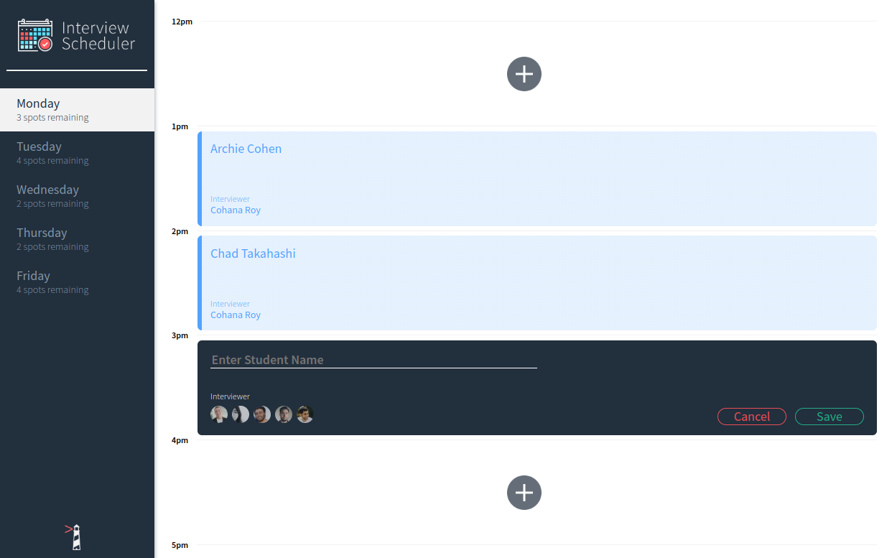
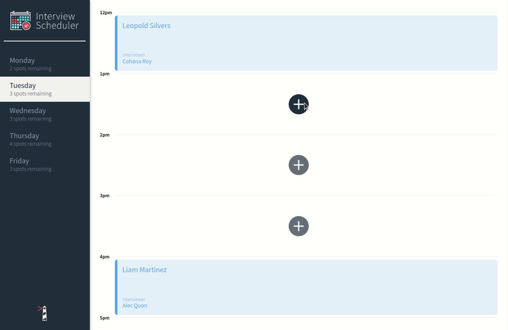
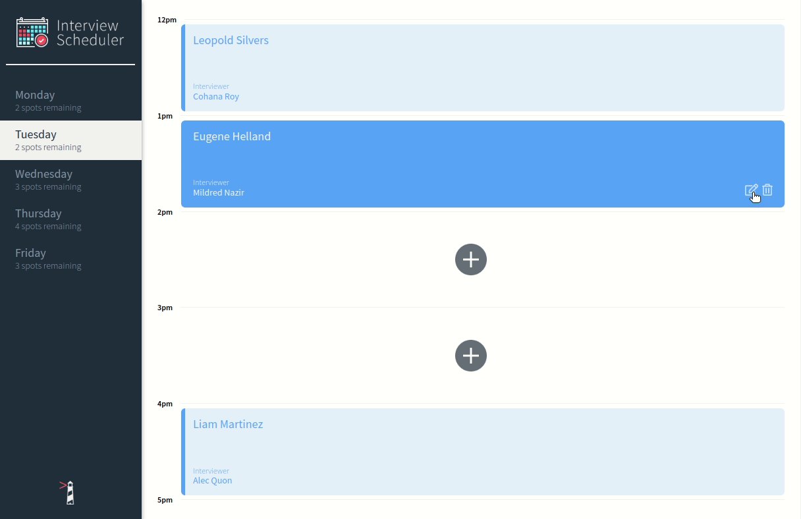
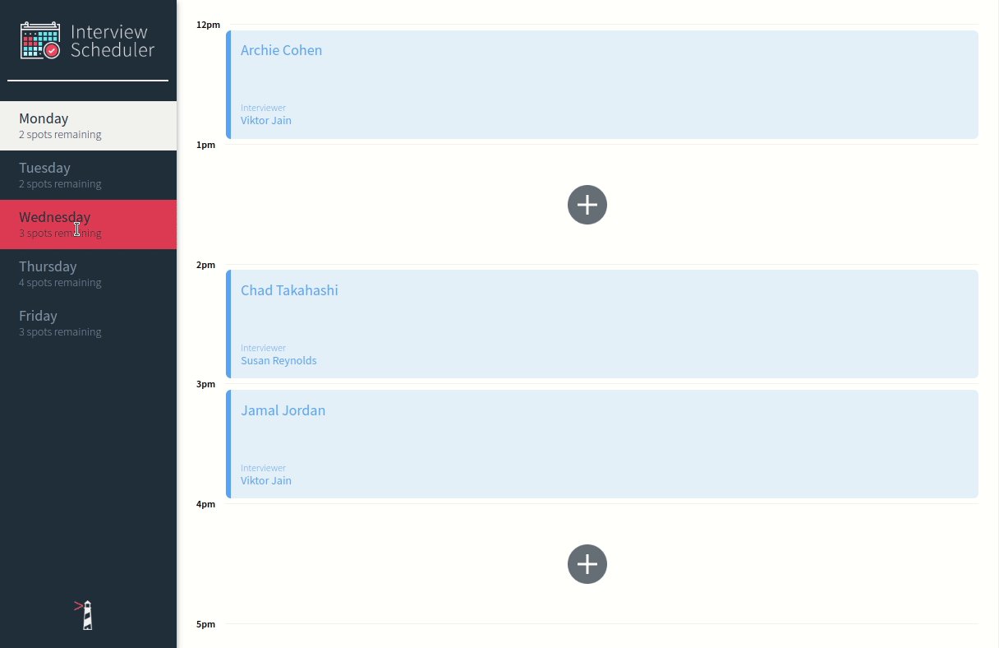

# Interview Scheduler

## Table Of Contents

- [Summary](#summary)
  - [Purpose](#purpose)
- [Features](#features)
  - [Screenshots](#screenshots)
  - [GIFs]()
- [Getting Started](#getting-started)
  - [Setup](#setup)
    - [Running Dev Server](#running-webpack-development-server)
    - [Running Jest](#running-jest-test-framework)
    - [Running Storybook](#running-storybook-visual-testbed)
- [About](#about)
  - [Frameworks and Libraries](#frameworks-and-libraries)
 

# Summary
Interview Scheduler is a **Single-Page Application (SPA)** built using **React.js**.

## Purpose
This application was created by as part of the **Lighthouse Labs' Web Development Bootcamp** curiculum. Its purpose was to practice creating React components, managing state based user interfaces, unit testing, integration testing, and end-to-end testing.

## Features
Users can:
- Book appointments for Monday - Friday
- Book appointments with a specific interviewer
- Edit existing appointments
- Cancel/Delete existing appointments

## Screenshots
### Scheduler - Main Layout


### Scheduler - Editing Appointment


## GIFs
### Create Appointment


### Edit Appointment


### Delete Appointment


# Getting Started
## Setup
Install dependencies with `npm install`.

Note: this project requires [Lighthouse Labs' Api](https://github.com/lighthouse-labs/scheduler-api) server made specifically for this project

### Running Webpack Development Server
```sh
npm start
```

The server will be hosted at `http://localhost:8000/`

### Running Jest Test Framework
```sh
npm test
```

### Running Storybook Visual Testbed

```sh
npm run storybook
```

### Running Cypress Test Environment & Seed Data
- From the [scheduler-api (server)](https://github.com/lighthouse-labs/scheduler-api) directory: 
    ```sh
    npm run test:server
    ```
- From the root of the Interview Scheduler client directory:
    ```sh
    npm run start:test
    npm run cypress
    ```
- To Reset the seed data, visit http://localhost:8001/api/debug/reset

## Dependencies

- axios: ^0.26.1
- classnames: ^2.2.6
- normalize.css: ^8.0.1
- react: ^16.9.0
- react-dom: ^16.9.0
- react-scripts: 3.0.0
- @testing-library/react-hooks: ^7.0.2
- react-test-renderer: ^16.9.0
  - Note: react-test-rendered must be the same version as React
  - ` npm install --save-dev react-test-renderer@^16.9.0`

# About

## Frameworks and Libraries

- React
- Jest
- Storybook
- Cypress
